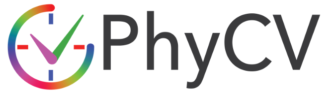

<p align="center">
  
</p>

# PhyCV CUDA: Optimized CUDA Code for Running PhyCV Algorithms on Edge Devices

Welcome to PhyCV CUDA! In this repository, you can find the source code needed to build and run the CUDA versions of the PhyCV algorithms on edge devices like NVIDIA's Jetson Nano. 

## Contents

* [Introduction](#introduction)

* [Folder Structure](#folder-structure)

* [Installation](#installation)

* [Algorithms](#algorithms)

* [Sample Results](#sample-results)

## Introduction 

PhyCV CUDA holds the source files needed to run the C++/CUDA versions of the [PhyCV](https://github.com/JalaliLabUCLA/phycv/) algorithms. The PhyCV CUDA source code can be built and run on any machine with C++/CUDA support. Testing and benchmarks are done on NVIDIA's Jetson Nano. 

## Folder Structure

- `assets`: This folder contains sample input images/videos, sample results, documentations.
- `phycv_cuda`: This folder contains the source code of PhyCV CUDA.
  - `main.cpp`: This file serves as the entry point for the application.
  - `options.cpp`: This file processes command-line options.
  - `video.cpp`: This file contains code for running the VEViD algorithm on input images, videos, and camera feeds.
  - `detect_net.cpp`: This file uses the Jetson Inference library to run object detection on output images, videos, and camera feeds. 
  - `vevid.cu`: This file provides the implementation of the vevid algorithm.
  - `kernels.cu`: This file provides the implementations of the CUDA kernels required to run the vevid algorithm. 

## Get Started

### Platforms 
- This repo is tested on NVIDIA Jetson Nano 4GB, Jetpack: 4.6.4, CUDA: 10.2.300, OpenCV: 4.1.1 TODO: Format this bullet point
- TODO: Add link to Jetson Inference Repo instructions to configure and build for Jetson Nano

## Installation

These algorithms use `CUDA` to leverage parallel processing on the GPU. Make sure you have a compatible GPU and that you have set up `CUDA` before the installation. 

**From Source**

```bash
git clone https://github.com/TaejusYee2001/PhyCV_CUDA.git
```
## Algorithms

* Vision Enhancement via Virtual diffraction and coherent Detection (VEViD)

  **Build**
  ```bash
  cd phycv_cuda
  make
  ```
  **Run**
  ```
  ./vevid
  ```
  TODO: 3 examples, run image, run video, run camera, explain options (object detection, vevid lite, reading/writing video, display timing values, change algorithm parameters etc...)
